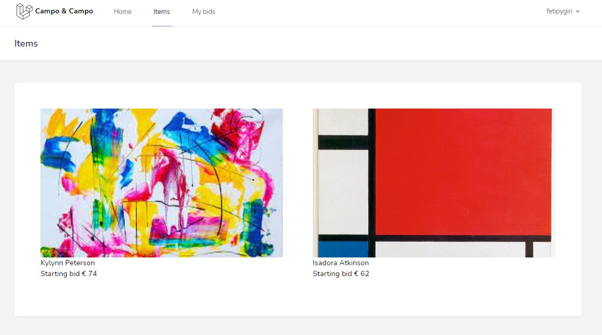

# Laravel 8 Auction-website

#### Description

Small project where users can bid on art. With a focus on backend.

#### Guest can

-   Home page basic info
-   Items page with overview with art
-   Single Art page with info about the art

#### Users can

-   Bid on art pieces on art
-   Leave a comment on an art piece
-   See there bids on My Bids page
-   reset ther password

#### Admin can

-   Create & Edit & Delete art pieces
-   See an overview of all the bids
-   See an overview of all the comments
-   Delete comments

#### DB seeders

-   Create one admin user

    

